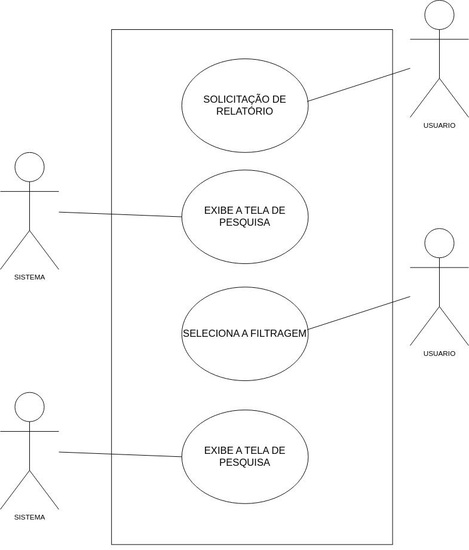
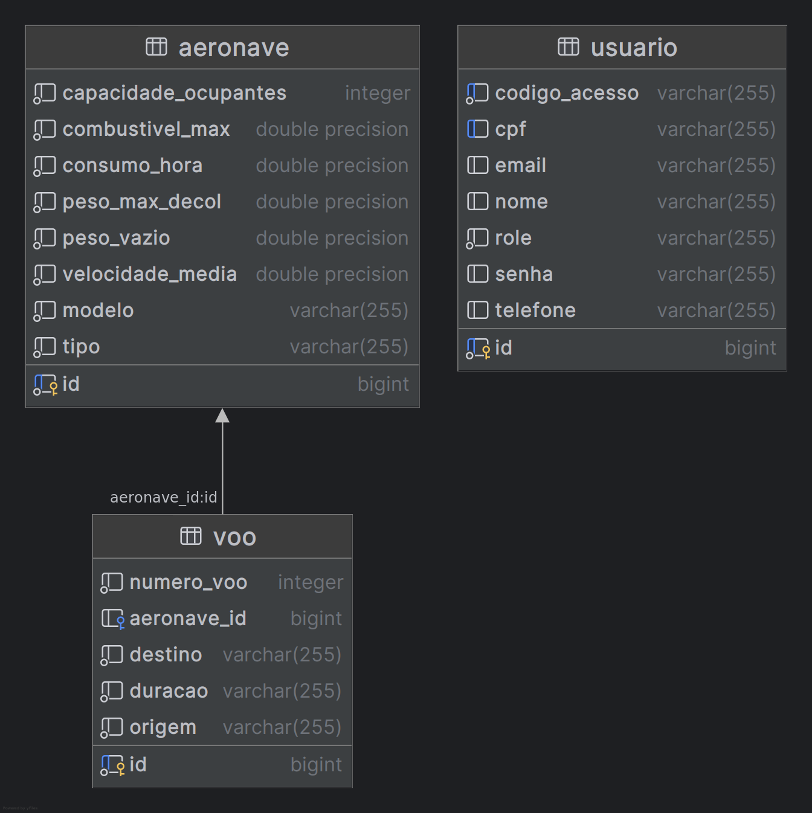

## Sumário
1. [VISÃO GERAL DO SISTEMA](#1-visão-geral-do-sistema)
2. [DIAGRAMA DE ATIVIDADES](#2-diagrama-de-atividades)
3. [LEVANTAMENTO DE REQUISITOS](#3-levantamento-de-requisitos)

   3.1. [REQUISITOS FUNCIONAIS](#31-requisitos-funcionais)
   
   3.2. [REQUISITOS NÃO FUNCIONAIS](#32-requisitos-não-funcionais)
   
   3.3. [REQUISITOS SUPLEMENTARES](#33-requisitos-suplementares)

4. [DETALHAMENTO DE REQUISITOS](#4-detalhamento-de-requisitos)
5. [CASOS DE USO](#5-casos-de-uso)
6. [DIAGRAMA DE SEQUÊNCUA ](#6-diagramas-de-sequência)
7. [MODELO CONCEITUAL](#7-modelo-conceitual)
8. [MODELO RELACIONAL ](#8-modelo-relacional)
9. [DIAGRAMA DE CLASSES](#9-diagramas-de-classes)

---

## 1. VISÃO GERAL DO SISTEMA

O sistema gerenciará o controle de aeronaves e voos da companhia aérea Cavalo Airlines, além de voos internacionais, considerando a origem e o destino das viagens e realizando verificações geográficas em tempo real. Desenvolvido para plataforma web, permitirá que funcionários façam login com e-mail e senha. O sistema gerará relatórios detalhados sobre aeronaves da companhia. Além disso, administrará os funcionários, com os administradores realizando o pré-cadastro dos colaboradores. Com uma camada de autenticação segura, o sistema garantirá que apenas funcionários autorizados possam acessar suas funcionalidades e informações, otimizando o controle operacional da frota e a gestão dos voos.

---

## 2. DIAGRAMA DE ATIVIDADES

_O diagrama acima representa o processo de Rastreamento de um Voos_

_O diagrama acima representa o processo de gerenciamento de Aeronaves_

_O diagrama acima representa o processo de gerenciamento de Voos_

_O diagrama acima representa o processo de gerenciamento de Funcionarios_

_O diagrama acima representa o processo de gerenciamento de Planejamento_

---

## 3. LEVANTAMENTO DE REQUISITOS

---
### 3.1. REQUISITOS FUNCIONAIS

1. Gerenciar funcionarios
2. Gerenciar voos
3. Gerenciar aeronaves
4. Realizar o rastreamento de voos
5. Gerar Planejamento

---

### 3.2. REQUISITOS NÃO FUNCIONAIS

1. A criação de usuários deverá ser realizada por meio de um processo de pré-cadastro, onde será definido o código de acesso e o cargo do usuário no sistema.

2. O cadastro dos usuários deve conter email, senha, cpf, nome e telefone.

3. O sistema deverá calcular a autonomia de cada aeronave por meio do seguinte cálculo: $Autonomia = \frac{Combustível Máximo}{Consumo Por Hora} \times Velocidade Média$
   
4. Pesquisa de aeronaves de terceiro por meio de IATA/ICAO.

5. Fazer Requisição de dados aéreos por meio da API "Aviation Stack"

6. O sistema deverá calcular o peso disponível para ser preenchido em cada voo através do seguinte cálculo: $Peso livre = Peso Máximo de  decolagem - Peso da Aeronave Vazia$.

7. O sistema deverá calcular o número de cadeiras para a primeira classe e para a classe econômica de acordo com a seguinte regra: a primeira classe deve ocupar 40% das cadeiras totais, e a classe econômica será composta pelas cadeiras restantes. No entanto, se a quantidade total de cadeiras for inferior ou igual a 20, todas as cadeiras serão destinadas exclusivamente à primeira classe.

8. O sistema deverá fornecer a quantidade de voos cadastrados para cada aeronave.

9. O sistema deverá gerar um código de acesso para os funcionários, o qual deverá conter 12 dígitos, sendo uma combinação de números e letras.

10. O sistema deverá ter três usuários administradores cadastrados, que não poderão ser editados ou excluídos. As informações necessárias para o cadastro desses usuários serão fornecidas pelos responsáveis de cada conta.

11. O sistema devera permitir que somente usuarios admins acesse a pagina de funcionarios.

12. O cadastro do voo deve incluir o número do voo, a origem, o destino e a distância do percurso,  conforme as orientações estabelecidas pelo departamento responsável.

---

### 3.3. REQUISITOS SUPLEMENTARES

1. O sistema deve operar via interface Web
2. O sistema deve ser desenvolvido na linguagem Java e JavaScript
3. O sistema deve utilizar o banco de dados PostgreSQL
4. O sistema utilizará a API AviationStack.
5. O sistem deve utilizar autenticação por JWT.

---

## 4. DETALHAMENTO DE REQUISITOS 

| **RF1. Gerenciar funcionarios** |
|:---|
| **Descrição:** O usuário administrador terá a capacidade de criar e editar os dados de novos funcionários que serão integrados ao sistema. Este processo incluirá a definição de permissões, a atribuição de um código de acesso e a escolha do cargo. Após o pré-cadastro, o usuário administrador deverá compartilhar o código de acesso com o funcionário, que, por sua vez, usará esse código para se cadastrar no sistema, fornecendo as informações necessárias.|
| **Fontes:** Administradores da Cavalo Airlines|
| **Usuários:** Usuario Administrador e Usuario padrão|
| **Informações de entrada:** O sistema gerará um código de acesso; o usuário administrador selecionará o cargo do novo funcionário. Após isso, o administrador compartilhará o código de acesso. O novo funcionário usará esse código para acessar o sistema e preencher seus dados. | 
| **Informações de saída:** O sistema exibirá uma confirmação visual com uma mensagem de sucesso, informando que o novo usuário foi criado corretamente, juntamente com a exibição das credenciais de acesso geradas na página de funcionários. |
| **Requisitos não funcionais:** RNF 1: A criação de usuários deverá ser realizada por meio de um processo de pré-cadastro, onde será definido o código de acesso e o cargo do usuário no sistema.  RNF 2: O cadastro dos usuários deve conter email, senha, cpf, nome e telefone.  RNF 9: O sistema deverá gerar um código de acesso para os funcionários, o qual deverá conter 12 dígitos, sendo uma combinação de números e letras.  RNF 10: O sistema deverá ter três usuários administradores cadastrados, que não poderão ser editados ou excluídos. As informações necessárias para o cadastro desses usuários serão fornecidas pelos responsáveis de cada conta.  RNF 11: O sistema devera permitir que somente usuarios admins acesse a pagina de funcionarios.|

---

| **RF2. Gerenciar voos** |
|:---|
| **Descrição:** O sistema deverá gerenciar os voos da companhia aérea, permitindo que os usuários cadastrem, editem e excluam informações sobre os voos. Isso inclui todas as operações necessárias para o gerenciamento eficaz, garantindo que as informações relevantes estejam sempre atualizadas e precisas.|
| **Fontes:** Departamento de Gerenciamento de Voos|
| **Usuários:** Usuário Administrador e Usuário Padrão|
| **Informações de entrada:** O usuário deverá fornecer as informações básicas para cadastrar um voo, incluindo o número do voo, a origem, o destino e a distância do percurso. Além disso, o usuário deverá selecionar a aeronave responsável por esse voo. O sistema também permitirá que o usuário edite ou exclua voos existentes.|
| **Informações de saída:** Após o cadastro, a edição ou a exclusão de um voo, o sistema atualizará a tela de exibição, refletindo as alterações realizadas.|
| **Requisitos não funcionais:** RNF 12: O cadastro do voo deve incluir o número do voo, a origem, o destino e a distância do percurso, conforme as orientações estabelecidas pelo departamento responsável.|

---

| **RF3. Gerenciar aeronaves** |
|:---|
| **Descrição:** O sistema deverá gerenciar as aeronaves da companhia aérea, permitindo que os usuários cadastrem, editem e excluam informações sobre as aeronaves. Isso inclui todas as operações necessárias para o gerenciamento eficaz, garantindo que as informações relevantes estejam sempre atualizadas e precisas.|
| **Fontes:**  Departamento gestor de aeronaves|
| **Usuários:** Usuário Administrador e Usuário Padrão|
| **Informações de entrada:** O usuario poderá cadastrar, editar e excluir uma aeronave.  * Modelo  * Tipo  * Peso Máximo de Decolagem  * Peso Vazio  * N° maximo de ocupantes  * Velocidade Média  * Combustivel Máximo  * Consumo por hora de Combustivel|
| **Informações de saída:** Após o cadastro, a edição ou a exclusão de um voo, o sistema atualizará a tela de exibição, refletindo as alterações realizadas. |
| **Requisitos não funcionais:** RNF 3: O sistema deverá calcular a autonomia de cada aeronave por meio do seguinte cálculo: $Autonomia = \frac{Combustível Máximo}{Consumo Por Hora} \times Velocidade Média$.  RNF 6: O sistema deverá calcular o peso disponível para ser preenchido em cada voo através do seguinte cálculo: $Peso livre = Peso Máximo de  decolagem - Peso da Aeronave Vazia$.  RNF 7: O sistema deverá calcular o número de cadeiras para a primeira classe e para a classe econômica de acordo com a seguinte regra: a primeira classe deve ocupar 40% das cadeiras totais, e a classe econômica será composta pelas cadeiras restantes. No entanto, se a quantidade total de cadeiras for inferior ou igual a 20, todas as cadeiras serão destinadas exclusivamente à primeira classe. |

---

| **RF4. Realizar busca de registros de aeronaves internacionais** |
|:---|
| **Descrição:** O recurso permite que o usuário realize buscas por viagens passadas e futuras, consulte dados de viagens anteriores de aeronaves internacionais  |
| **Fontes:** Documentação do sistema e Documentação da API |
| **Usuários:** Usuário Administrador e Usuário Padrão |
| **Informações de entrada:** O usuário deve informar o código IATA/ICAO do vôo desejado. |
| **Informações de saída:** Tela com as informações de voos compatíveis com a busca, priorizando uma ordem e um mapa com sua localização atual caso esteja ativo.  |
| **Requisitos não funcionais:**  Funciona a partir de requisição ao Banco de Dados DA API |

---

| **RF5. Gerar Planejamento** |
|:---|
| **Descrição:** O sistema deverá gerar um relatório detalhado para cada aeronave cadastrada, permitindo a aplicação de filtros para selecionar aeronaves específicas. O relatório deverá incluir informações sobre a autonomia, quantidade de voos, número de assentos da primeira classe e da classe econômica, além do peso disponível para cada aeronave. |
| **Fontes:** Departamento de gereciamento de rotas |
| **Usuários:** Usuário Administrador e Usuário Padrão |
| **Informações de entrada:** O usuário poderá aplicar filtros para buscar aeronaves específicas, selecionando o modelo da aeronave e iniciando a busca. |
| **Informações de saída:** O sistema atualizará a tela de exibição, apresentando o relatório detalhado das aeronaves com as informações filtradas.  |
| **Requisitos não funcionais:** RNF 3: O sistema deverá calcular a autonomia de cada aeronave por meio do seguinte cálculo: $Autonomia = \frac{Combustível Máximo}{Consumo Por Hora} \times Velocidade Média$.  RNF 6: O sistema deverá calcular o peso disponível para ser preenchido em cada voo através do seguinte cálculo: $Peso livre = Peso Máximo de  decolagem - Peso da Aeronave Vazia$.  RNF 7: O sistema deverá calcular o número de cadeiras para a primeira classe e para a classe econômica de acordo com a seguinte regra: a primeira classe deve ocupar 40% das cadeiras totais, e a classe econômica será composta pelas cadeiras restantes. No entanto, se a quantidade total de cadeiras for inferior ou igual a 20, todas as cadeiras serão destinadas exclusivamente à primeira classe.  RNF 8: O sistema deverá fornecer a quantidade de voos cadastrados para cada aeronave. |

---

## 5. CASOS DE USO

| **UC01. CADASTRO DE USUÁRIO** |
|:---|
| **NOME DO CASO DE USO:**   Cadastro de usuário |
| **ATOR:**  Funcionário | 
| **OBJETIVO:**   Oferecer a possibilidade de cadastro no sistema para utilizar os serviços oferecidos.|
| **PRÉ-CONDIÇÕES:**   1. O usuário não deve possuir uma conta registrada no sistema e um administrador deve ter criado um código de acesso para ele.|
| **PÓS-CONDIÇOES:**   O usuário é registrado no sistema e pode realizar login para utilizar as funcionalidades disponíveis.|
| **CENÁRIO PRINCIPAL:**   1. [IN]O usuário acessa a página de cadastro.   2. [IN] O usuário preenche o formulário de cadastro com as informações necessárias e o código de acesso pré registrada por um administrador [RN1] 3. [OUT] O sistema valida as informações fornecidas. [E1] [E2]  4.[OUT] O sistema registra o novo usuário no banco de dados.   5. [OUT] O sistema exibe uma mensagem de confirmação e envia um alerta de boas-vindas ao usuário.|
| **CENÁRIO ALTERNATIVO:**  |
|**EXCEÇÃO** [E1] Se o e-mail fornecido já estiver associado a uma conta existente, o sistema notifica o usuário e solicita a utilização de outro e-mail ou o login com a conta existente.   [E2] Se alguma informação estiver incorreta ou faltar, o sistema exibe uma mensagem de erro e solicita que o usuário corrija as informações.| 
|**REGRAS DE NEGÓCIO**   RN1 - O usuário deve preencher campos com NOME, CPF, TELEFONE, E-MAIL, SENHA e CÓDIGO DE ACESSO . |

 

---

| **UC02 CRUD DE AERONAVE** |
|:---|
| **NOME DO CASO DE USO:**   Cadastro de aeronave |
| **ATOR:**   Funcionário |
| **OBJETIVO:**   Permitir o cadastro de novas aeronaves no sistema. |
| **PRÉ-CONDIÇÕES:**  O funcionário deve estar autenticado no sistema. |
| **PÓS-CONDIÇOES:**   A o vôo é registrada no sistema e está disponível para operações. |
| **CENÁRIO PRINCIPAL:** |
| 1. [IN] O Funcionário acessa a página de cadastro de voos.   2. [IN] O funcionário preenche o formulário de cadastro com as informações necessárias [RN1].   3. [OUT] O sistema valida as informações fornecidas. [E1]   4. [OUT] O sistema registra a nova aeronave no banco de dados.   5. [OUT] O sistema exibe uma mensagem de confirmação do cadastro.
| **CENÁRIO ALTERNATIVO:** |
| **EDITAR**   1. [IN] Usuário realiza busca do objeto desejado, seleciona   2. [IN]  clica em editar   3. [IN]  Altera os dados desejados    4. [OUT] retorna a página com dados atualizados|
| **DELETAR**   1. [IN] Usuário realiza busca do objeto desejado, seleciona   2. [IN]  clica em editar.  3. [OUT] retorna a página com sem o objeto deletado|
| **EXCEÇÃO** [E1] Se alguma informação estiver incorreta ou faltar, o sistema exibe uma mensagem de erro e solicita que o administrador corrija as informações. |  
| **REGRAS DE NEGÓCIO**  RN1 - O administrador deve preencher campos obrigatórios: Modelo, Tipo, Peso Máx. Decolagem, Peso Vazio, Nº Máx. de Ocupantes, Velocidade Média, Combustível Máximo, Combustível por Hora.  RN0. O sistema de cadastro é persistente, caso não queira mais adiconar aeronaves, basta clicar fora da tela de cadastro |

 

---

| **UC03. CRUD DE VOO** |
|:---|
| **NOME DO CASO DE USO:**  Cadastro de voo |
| **ATOR:** Funcionário | 
| **OBJETIVO:**  Permitir o cadastro de novos voos no sistema.|
| **PRÉ-CONDIÇÕES:**  1. O usuário deve possuir uma conta registrada no sistema e a aeronave que será usada também deve estar cadastrada.|
| **PÓS-CONDIÇOES:**  O usuário é registrado no sistema e pode realizar login para utilizar as funcionalidades disponíveis.|
| **CENÁRIO PRINCIPAL:**   1. [IN]O Funcionário acessa a página de cadastro.   2. [IN] O funcionário preenche o formulário de cadastro com as informações necessárias [RN1] 3. [OUT] O sistema valida as informações fornecidas. [E1]  4.[OUT] O sistema registra o novo voo no banco de dados.  |
| **CENÁRIO ALTERNATIVO:**  |
|**EXCEÇÃO** [E1] Se alguma informação estiver incorreta ou faltar, o sistema exibe uma mensagem de erro e solicita que o administrador corrija as informações  | 
|**REGRAS DE NEGÓCIO**  RN1 - O usuário deve preencher campos obrigatórios: N° Voo, Aeronave, Duração, Origem, Destino.
 RN0. O sistema de cadastro é persistente, caso não queira mais adiconar voos, basta clicar fora da tela de cadastro |

 

---

| **UC04. RELATÓRIO  DE AERONAVES DA EMPRESA** |
|:---|
| **NOME DO CASO DE USO:**  Relatório de aeronaves |
| **ATOR:**  Fucionário | 
| **OBJETIVO:**  Emissão do relatório de aeronaves.|
| **PRÉ-CONDIÇÕES:**  1. Cadastro da aeronaves.|
| **PÓS-CONDIÇOES:**  Não há|
| **CENÁRIO PRINCIPAL:**  1. [IN] O usuário acessa a interface de pesquisa escolhendo a filtragem desejada .  2. [INT] O sistema valida o o dado pesquisado.   3. [OUT] O sistema retorna as aeronaves que batem com a pesquisa. 
| **CENÁRIO ALTERNATIVO:**   NÃO HÁ  |

---

| **UC04. RELATÓRIO DE VOOS DA EMPRESA** |
|:---|
| **NOME DO CASO DE USO:**  Relatório de vos |
| **ATOR:**  Funcionário | 
| **OBJETIVO:**  Emissão do relatório de voos.|
| **PRÉ-CONDIÇÕES:**  1. Cadastro de voos.|
| **PÓS-CONDIÇOES:**  Não há|
| **CENÁRIO PRINCIPAL:**  1. [IN] O usuário acessa a interface de pesquisa escolhendo a filtragem desejada .  2. [INT] O sistema valida o o dado pesquisado.   3. [OUT] O sistema retorna os voos da empresa que batem com a pesquisa. |
| **CENÁRIO ALTERNATIVO:**   NÃO HÁ  |

 

---

| **UC05. PESQUISA DE VOOS API** |
|:---|
| **NOME DO CASO DE USO:**  PESQUISA DE VOOS INTERNACIONAIS |
| **ATOR:** Funcionário | 
| **OBJETIVO:**  Oferecer a de voos existentes no sistema aéreo mundial através do Código IATA/ICAO.|
| **PRÉ-CONDIÇÕES:**  1. O usuário deve possuir uma conta registrada no sistema   A chave Key da API com o sistema deve possuir requisições mensal disponível.|
| **PÓS-CONDIÇOES:**  O sistema registra a requisição e retorna dados sobre a aeronave, datas de voos, ativos, cancelados, concluídos e agendados além de um mapa com sua localização caso esteja com ativo|
| **CENÁRIO PRINCIPAL:**  1. [IN] O cliente acessa a interface de pesquisa de voos. 2. [IN] O sistema solicita que o cliente insira o código IATA ou ICAO do voo.   3. [IN] O cliente insere o código do voo e confirma a pesquisa.   4. [OUT] O sistema valida o código inserido. [RN1]  5. [OUT] O sistema consulta a API da AviationStack. [RN2]  6. [OUT] A API retorna os dados do voo, como aeronave, status e localização. [E1] [E2]   7. [OUT] Caso o voo esteja ativo, o sistema exibe a localização em tempo real em um mapa.   8. [OUT] O sistema apresenta os dados ao cliente.   9. [OUT] O sistema registra a consulta no histórico.   10. [OUT] O cliente finaliza a pesquisa. |
| **CENÁRIO ALTERNATIVO:**|
| **EXCEÇÃO** [E1] O cliente tenta pesquisar um voo, o sistema tenta acessar a API, mas está indisponível, em seguida o sistema exibe uma mensagem de erro: "Falha na pesquisa." [RN3], O sistema registra a tentativa de acesso e o erro.    [E2] O cliente insere um código inválido ou de voo inexistente. O sistema detecta o código como inválido ou a API não encontra o voo. [RN1]. O sistema exibe uma mensagem de erro: "Voo não encontrado."|
| **REGRAS DE NEGÓCIO:**  [RN1] - O sistema deve validar o código IATA ou ICAO inserido pelo cliente. [RN2] - O sistema só deve acessar a API se a chave de API estiver válida e com requisições disponíveis.   [RN3] - O sistema deve registrar e notificar o cliente em caso de falha na pesquisa devido à indisponibilidade da API. |

 

---

## 6. DIAGRAMAS DE SEQUÊNCIA

|**CRUD USUÁRIO**|
|:---|
| 1. [IN] Um administrador cria um código de Acesso pro novo usuário   2.[OUT]. O sistema retorna o código de acesso pela lista  3. [IN] O usuário acessa a página de cadastro.   4. [IN] O usuário preenche o formulário de cadastro com as informações necessárias  5. [OUT] O sistema valida as informações fornecidas. [E1.1] [E1.2] 6.[OUT] O sistema registra o novo usuário no banco de dados.   7. [OUT] O sistema exibe uma mensagem de confirmação e envia um e-mail de boas-vindas ao usuário.||

 

|**CRUD VOOS**|
|:---|
|1. [IN]O usuário acessa a página de cadastro de voos.   2. [OUT] Sistema retorna página de cadstro de voos.    3. [IN] O usuário preenche o formulário de cadastro com as informações necessárias  4. [OUT] O sistema valida as informações fornecidas. [E2.1]  5.[OUT] O sistema retorna o novo voo registrado.  |
 
 

| **CRUD AERONAVES**| 
|:---|
| 1. [IN]O usuário acessa a página de cadastro de aeronaves.   2. [OUT] Sistema retorna página de cadstro de aeronaves.    3. [IN] O usuário preenche o formulário de cadastro com as informações necessárias  4. [OUT] O sistema valida as informações fornecidas. [E2.1]  5.[OUT] O sistema retorna a nova aeronave registrada.  |

 

|**RELATÓRIO DE AERONAVES**| 
|:---|
|1. [IN] O usuário acessa a interface de pesquisa escolhendo a filtragem desejada .  2. [OUT] O sistema valida o o dado pesquisado.   3. [OUT] O sistema retorna as aeronaves que batem com a pesquisa. |

|**RELATÓRIO DE VOOS**|
|:---|
|1. [IN] O usuário acessa a interface de pesquisa escolhendo a filtragem desejada .  2. [OUT] O sistema valida o o dado pesquisado.   3. [OUT] O sistema valida retorna os voos da empresa que batem com a pesquisa. |

|**REQUISIÇÃO DE VOOS INTERNACIONAIS PELA API**|
|:---|
| 1. [IN] O cliente acessa a interface de pesquisa de voos. 2. [IN] O sistema solicita que o cliente insira o código IATA ou ICAO do voo.   3. [IN] O cliente insere o código do voo e confirma a pesquisa.   4. [OUT] O sistema valida o código inserido. [RN1]  5. [INT] O sistema consulta a API da AviationStack.   6. [OUT] A API retorna os dados do voo, como aeronave, status e localização. [E5.1] [E5.2]   7. [OUT]O sistema apresenta os dados ao cliente.   8. [INT] Caso haja, o cliente solicita localização em tempo real em um mapa.   9. [OUT] O sistema retrna um mapa com a localização do voo   10. [INT] O cliente finaliza a pesquisa. |

 

---

## 7. Modelo Conceitual

_O diagrama acima representa a Modelagem Conceitual_

---

## 8. Modelo Relacional

_O diagrama acima representa a Modelagem Relacional_

---

## 9. Diagramas de Classes

_O diagrama abaixo representa o diagrama de classes da Estrutura de projeto Entity_

_O diagrama abaixo representa o diagrama de classes da Estrutura de projeto Repository_

_O diagrama abaixo representa o diagrama de classes da Estrutura de projeto Service_

_O diagrama abaixo representa o diagrama de classes da Estrutura de projeto DTO_

_O diagrama abaixo representa o diagrama de classes da Estrutura de projeto Security_

_O diagrama abaixo representa o diagrama de classes da Estrutura de projeto Controller_

