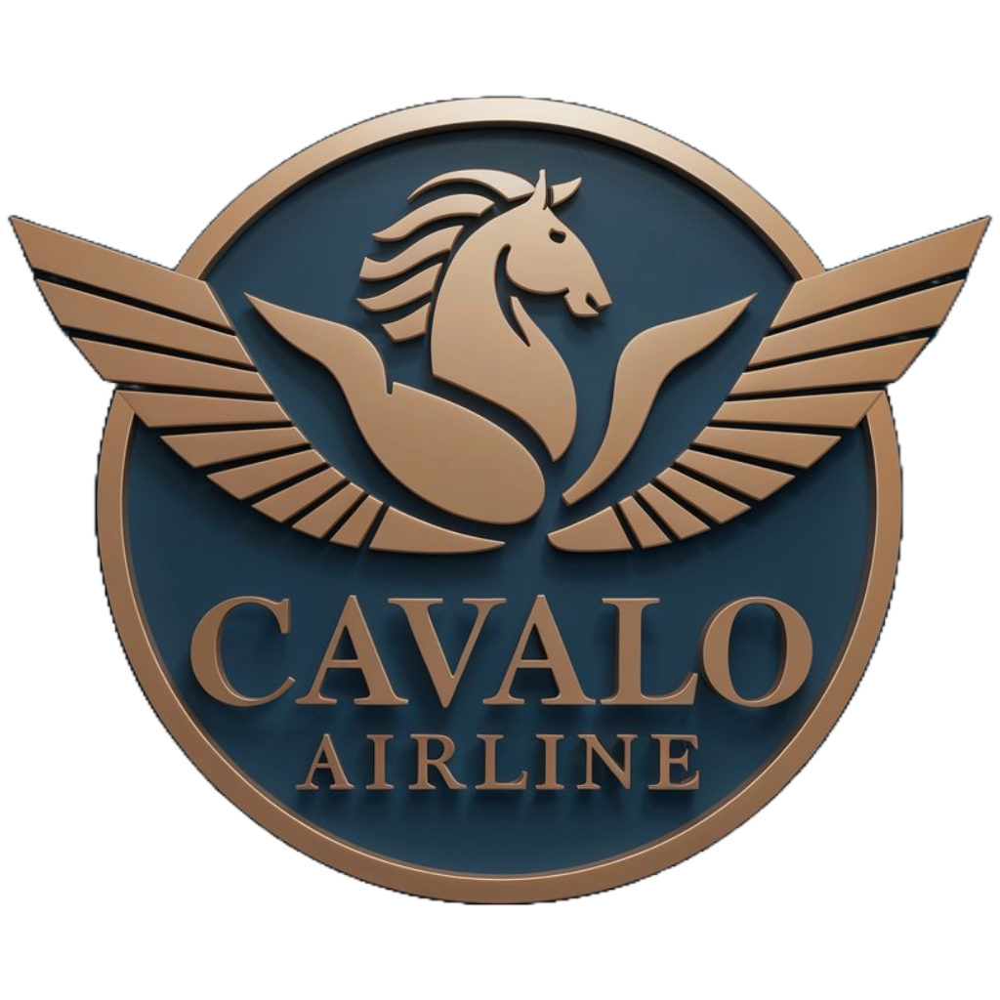

<!--- # "Can be a image or a gift from the project pages" -->
# Passo a Passo

  

# *Cavalo Airline* 
### Link para acesso: http://cavaloarlines.ddns.net:8080
obs: AWS só permite 4h de instância ligada, caso ela não esteja ligada, avise aos colaboradores para reiniciar
## Projeto Desenvolvimento De Softwares Corporativos 2024

Projeto para disciplina de DSC. 
Foi criado um sistema de gerenciamento de Voos e Aeronaves para Aeroportos visando gerenciamento rápido e eficiente tanto de objetos,funções e funcionários.
O Sistema possui acesso a API AviationStack para gerenciamento e conhecimento de voos em escala mundial além de posicionamento geográfico para percepção visual.

## Tech Stack

<!--- # "Verify icons availability here https://github.com/tandpfun/skill-icons" -->

## Getting Started

1. **Primeiro Acesso**: 
   1. Caso seja professor, utilize as credenciais email: `prof.paulo.veloso@gmail.com` senha: `Cavalo123@` para Login
   2. A partir desse momento terá acesso total como administrador.

2. **Criar Novo Usuário**: 
     1. Para criar o usuário você deve ir até a opção Funcionários na barra lateral
     2. Ao entrar na página de funcionários, existirá no canto superior direito um botão escrito  ***Incluir***
     3. Ao clicar nesse botão, aparecerá uma tela para escolher o cargo do novo Usuário e o código de acesso que ele utilizará no ato do Cadastro
     4. Para sair da tela de criação de código, basta clicar fora dela.
     5. Com o código recém criado, o novo funcionário poderá acessar a tela de cadastro e colocar suas credenciais e em seguida fazer login como novo funcionário.
     6. O sistema utiliza token persistente, para logar mais de um usuário, deve-se utilizar guia anônima.
     7. Os 3 usuários adimin criados junto ao sistema não podem ser excluídos e nem editados.

3. **Cadastro de Aeronaves**: 
     1. Para criar a nova aeronave você deve ir até a opção Aeronaves na barra lateral
     2. Ao entrar na página de Aeronaves, existirá no canto superior direito um botão escrito  ***Incluir***
     3. Ao clicar nesse botão, aparecerá uma tela para completar os campos de dados da aeronave.
     4. Para sair da tela de criação de código, basta clicar fora dela.
     5. Com a aeronave recém criado, você poderá editá-la ou excluí-la.

4. **Cadastro de voos**:
     1. Para criar o novo voo você deve ir até a opção Voos na barra lateral
     2. Ao entrar na página de Voos, existirá no canto superior direito um botão escrito  ***Incluir***
     3. Ao clicar nesse botão, aparecerá uma tela para completar os campos de dados do vôo.
     4. Para sair da tela de criação de código, basta clicar fora dela.
     5. Para criação de um vôo é preciso selecionar uma aeronave já criada na opção `Aeronave`
     6. Com o vôo recém criado, você poderá editá-lo ou excluí-lo.

5. **Relatório de Voos Internacionais**:
     1. Para acessar a barra de pesquisa de voos internacionais, você deve ir até a opção painel na barra lateral
     2. Ao entrar em painel, existirá no centro superior uma barra de pesquisa ao lado de dois botões verdes escrito  ***Rastrear Voos*** e ***Mostrar Todos os Voos***
     3. Para rastrear vôo, deve-se colocar na barra de pesquisa o código IATA/ICAO ex. `UA2402` e clicar em ***Rastrear Voos***.
     4. Caso queira ver todos os IATA/ICAO dispibilizados basta clicar em  ***Mostrar Todos os Voos***
     5. Você pode segregar a pesquisa de acordo com os status de cada linha, pela opção entre a barra de pesquisa e botões
     5. Para visualização de posicionamento geofráfico a linha aérea deve disponibilizar as coordenardas, e aquelas que disponibilizarem podem ser vistas clicando ao botão ***Mostrar no mapa*** ao lado.
     6. Existe um limite para quantidade de voos que podem ser retornadas, nesse sentido nem todos os vôos podem ser vistos numa mesma requisição

## Colaboradores

1. **Principais Colaboradores**: João Pedro Santos Rodrigues e Kelton Martins Dias
2. **Clone project**: `git@github.com:Keltonmd/Desenvolvimento-de-Sitemas-Corporativos.git`

## License

This software is available under the following licenses:

- [MIT](https://rem.mit-license.org)

